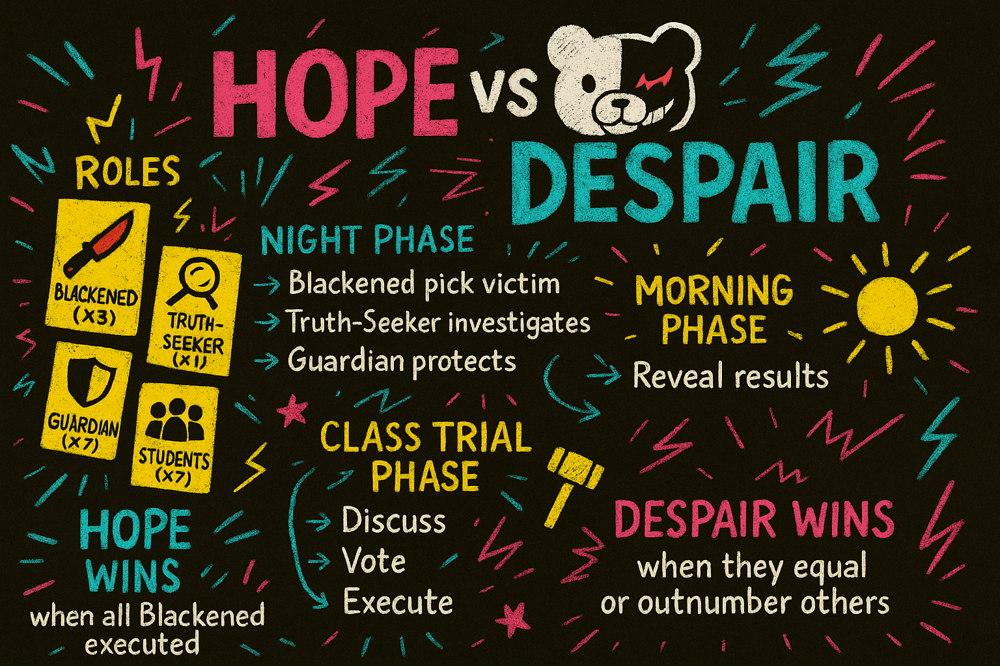
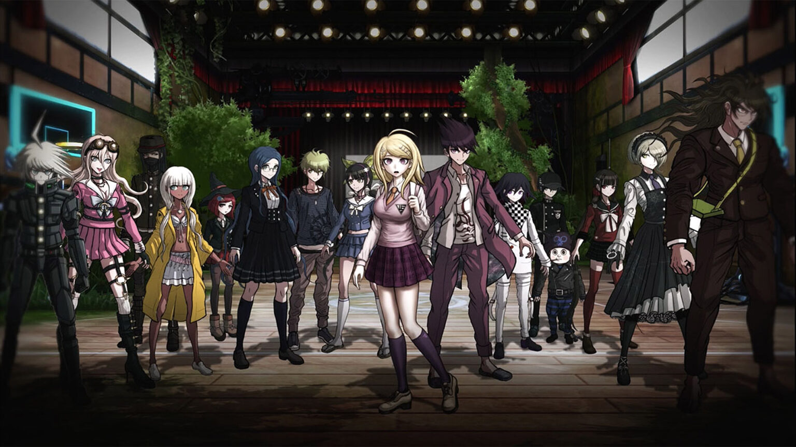

<h1 align="center">The Ultimate AI Experiment: Danganronpa Simulator</h1>

[](https://github.com/The-Pocket/PocketFlow-Tutorial-Danganronpa-Simulator/blob/main/LICENSE)
[](https://streamlit.io)
[](https://github.com/The-Pocket/PocketFlow)
[](https://discord.gg/hUHHE9Sa6T)

> *Ever wondered what happens when super-smart AI isn't just a tool, but a player in a crazy game of lies, strategy, and survival? This project is an AI-powered Danganronpa simulator where the characters are anything but predictable, brought to life by AI agents.*

<p align="center">
  <a href="https://danganronpa.app/" target="_blank">
    
  </a>
</p>

<p align="center">
  <strong>🎮 Play the Game Now: <a href="https://danganronpa.app/" target="_blank">https://danganronpa.app/</a> 🎮</strong>
</p>

<br />

This is a tutorial project of [**Pocket Flow**](https://github.com/The-Pocket/PocketFlow), a 100-line LLM framework.

- Dive into the story and philosophy behind the development: [**Part 1**](https://pocketflow.substack.com/p/the-ultimate-ai-experiment-when-llms), [**Part 2**](https://pocketflow.substack.com/p/the-ultimate-ai-experiment-when-llms-925).
  
- Watch the full development journey on the [**YouTube Tutorial**](https://www.youtube.com/@ZacharyLLM?sub_confirmation=1).

## 🕹️ Gameplay Introduction: Unleash AI into the Killing Game!

If LLMs are smart, why do many AI interactions in games still feel a bit... meh? We think the secret sauce is giving AIs more **personality** and putting them in a game that *forces* them to show it. So, we built **The Danganronpa Simulator!**

**Why Danganronpa? Because it's the perfect pressure cooker for AI!**
*   **Wild, Built-in Characters:** From the "Ultimate Detective" to the "Ultimate Supreme Leader," these aren't boring roles; they're deep character studies waiting for an AI to jump in.
  
*   **Gameplay That Creates Drama and Deception:** The constant danger and public accusations force AIs to think strategically, team up, betray each other, and fight for their (virtual) lives.

**So, How Does This Twisted Game Actually Work?**
Picture this: **12 players** are thrown into this high-stakes game of survival and deception. Here's a look at how it unfolds:
<p align="center">
    
</p>

**Meet the "Ultimate" Students:**
These are some of the characters you might encounter, each with their own unique personalities and talents, ready to be embodied by our AI agents:
<p align="center">
    
</p>

<p align="center">
  <strong>Watch Recorded Gameplay:</strong>
  Immerse yourself in the AI-driven chaos! Check out our playlist:
  <br /><br />
  ▶️ <a href="https://www.youtube.com/playlist?list=PLRYer4Da-4mJUSxS5oyn6GbXg4YWHe5Cr" target="_blank">Danganronpa AI Simulator Gameplay Playlist</a>
</p>


## 🚀 Host the Game Yourself

Want to run the Danganronpa Simulator on your own machine?

1.  **Clone the Repository:**
    ```bash
    git clone https://github.com/The-Pocket/PocketFlow-Tutorial-Danganronpa-Simulator
    cd PocketFlow-Tutorial-Danganronpa-Simulator
    ```

2.  **Install Dependencies:**
    (Python 3.8+ required)
    ```bash
    pip install -r requirements.txt
    ```

3.  **Set Up Your LLM:**
    *   **Option 1: Gemini 2.5 Flash (Recommended)**
      
        This project uses Google Gemini by default. You can either:
        *   Set your own environment variables for Vertex AI: `GEMINI_PROJECT_ID` and `GEMINI_LOCATION`.
        *   Or, get a key from [Google AI Studio](https://aistudio.google.com/app/apikey) and set the `GEMINI_API_KEY` environment variable.

    *   **Option 2: Use Other LLMs**
      
        Feel free to use other LLMs like OpenAI, Anthropic, or even local Llama models. You will need to modify the `call_llm_async` function in [`utils/call_llm.py`](./utils/call_llm.py).

        It should be an `async` function that takes a `prompt` (string) as input and returns the LLM's response (string).
        
        See more on implementing LLM utility functions for PocketFlow: [PocketFlow LLM Utility Guide](https://the-pocket.github.io/PocketFlow/utility_function/llm.html)

    You can verify if your LLM setup works by running:
    ```bash
    python utils/call_llm.py
    ```


4.  **Run the Streamlit App:**
    ```bash
    streamlit run app.py
    ```
    Open your browser to the local URL provided (usually `http://localhost:8501`).

## 💡 Development Tutorial


I built using [**Agentic Coding**](https://zacharyhuang.substack.com/p/agentic-coding-the-most-fun-way-to), the fastest development paradigm, where humans simply [design](docs/design.md) and agents [code](flow.py).

The secret weapon is [Pocket Flow](https://github.com/The-Pocket/PocketFlow), a 100-line LLM framework that lets Agents (e.g., Cursor AI) build for you.

Check out the Step-by-step YouTube development tutorial:

<div align="center">
  <a href="https://www.youtube.com/@ZacharyLLM?sub_confirmation=1" target="_blank">
    
  </a>
</div>
<br>

*   [`app.py`](./app.py): The main Streamlit application; handles UI, game state, and orchestrates agent turns.
*   [`flow.py`](./flow.py): Defines PocketFlow execution flows for AI agents (sequential/parallel decisions).
*   [`nodes.py`](./nodes.py): Implements the `DecisionNode`, the core AI logic where characters think and act.
*   [`utils/call_llm.py`](./utils/call_llm.py): Utility for asynchronous calls to the LLM.
*   [`assets/`](./assets/): Contains static assets:
    *   `assets/texts.py`: Character intros, Monokuma's dialogue, etc.
    *   Character folders (e.g., `assets/Shuichi/`): Sprites and voice lines. 
*   [`docs/design.md`](./docs/design.md): The comprehensive design document.