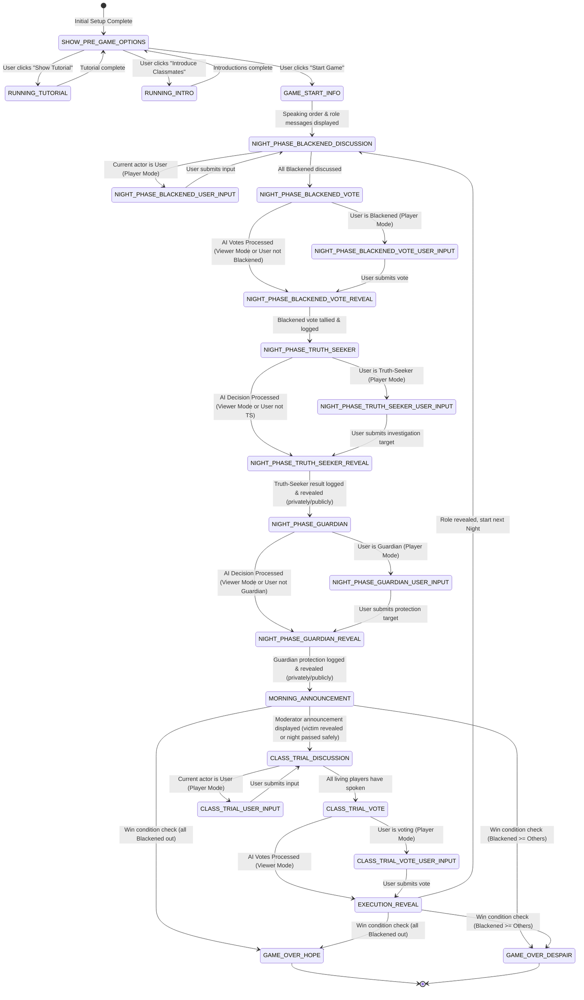

# App Design Document: Streamlit Interactive Sequence Display for Agentic Despair Academy

## 1. Overview

> *Note for AI: This document describes the design for the front-end and state management component of the "Agentic Despair Academy" project. The ultimate goal is to simulate a social deduction game with LLM agents. This design focuses on managing the game flow using Streamlit's session state and an in-memory SQLite database.*

This application uses Streamlit to manage and display the "Killing School Semester" social deduction game. It orchestrates interactions between LLM agents (players) and a central moderator (Monokuma). The application leverages a state machine to control the game phase, an in-memory SQLite database to log game events and store persistent state like roles, and potentially a task queue for displaying sequential moderator announcements.

## 2. Core Patterns

*   **Initial Setup:** Before the main game loop, Python code initializes the database connection, loads character data (e.g., player names) locally, performs role assignment into the DB, and sets the initial state to `SHOW_PRE_GAME_OPTIONS`. This setup runs once.
*   **State Machine:** Tracks the application's current phase (`st.session_state.current_state`), starting from `SHOW_PRE_GAME_OPTIONS`, to control game logic and UI rendering. The `SHOW_PRE_GAME_OPTIONS` state is only active before the game starts.
*   **Game Modes:** Offers different ways to experience the game: Player Mode (user controls Shuichi), AI Plays (Shuichi View - user watches from Shuichi's limited perspective), and AI Plays (Monokuma View - user watches with full omniscience).
*   **In-Memory SQLite Database:** Stores persistent game information like assigned roles and a log of all actions taken during the game. This allows for querying past events. Managed via utility functions.
*   **(Optional) Task Queue:** A list (`st.session_state.task_queue`) might still be used for displaying multi-step sequences like tutorials or Monokuma's verbose announcements, ensuring smooth visual flow.

## 3. Game Mechanics

### Core Game Loop

#### 1. Hidden‑Role Deck
Shuffle the 12 cards and deal one face‑down to each player.

| Role | Count | Night ability |
|------|------:|---------------|
| **Blackened** | 3 | Open eyes together and choose one player to eliminate. |
| **Truth‑Seeker** | 1 | Point to any player; the moderator replies **"Blackened"** or **"Student."** Note: your result is private—revealing it is allowed but risky because it makes you a target. |
| **Guardian** | 1 | Name any player (yourself allowed); that target is safe if attacked that night. Note: you may **not** protect the same person on consecutive nights. |
| **Students** | 7 | No night action. Rely on daytime discussion and voting. |

#### 2. Night → Morning Sequence
The moderator guides players through these steps every round:

1. **All eyes closed.**
2. **Blackened open eyes** and silently pick a victim → close eyes.
3. **Truth‑Seeker opens eyes** and selects one player to inspect → moderator whispers result → close eyes.
4. **Guardian opens eyes** and chooses a player to protect → close eyes.
5. **Everyone opens eyes.**
   * If the chosen victim was *not* protected, the moderator announces a body discovery.
   * If the Guardian saved the target, the moderator announces that no one died.

#### 3. Free Discussion & Class Trial
* **Speaking order:** each player makes one uninterrupted statement (accusation, defense, role claim, or bluff).
* After all have spoken, proceed directly to a **single vote**: point at (or write) the player you want expelled.
  * **Majority:** that player is executed and their role revealed.
  * **Tie:** no one is eliminated.

#### 4. Win Conditions
* **Hope Team** (Truth‑Seeker, Guardian, Students) wins when **all Blackened have been expelled or executed.**
* **Despair Team** (Blackened) wins when **the number of living Blackened ≥ the number of other living players.**

## 4. State Machine Diagram



## 5. Session State (`st.session_state`) Structure

```python
st.session_state = {
    # --- Core State and Control ---
    "current_state": "SHOW_PRE_GAME_OPTIONS", # Initial state after setup. See diagram.
    "current_day": 0,               # Tracks game rounds (Starts at 0, increments to 1 when game starts)
    "db_conn": None,                # Holds the sqlite3 connection object (initialized during setup)
    "task_queue": [],               # Optional: For sequential display tasks (e.g., Monokuma announcements)
    "user_character_name": "Shuichi", # Name of the character controlled by the human user (Assumption)
    "shuffled_character_order": [], # Stores the initial speaking/player order
    "current_phase_actors": None,   # NEW: List of names for the current iterative phase, or None if not initialized/active.
    "user_input": None,             # NEW: Stores the text input from the user (general)
    "inner_thought_submitted": False, # NEW: Tracks submission of user input
    "viewer_mode_selection": "Play as Shuichi", # Stores the raw string selected from the radio button (e.g., ":small[🎮 **You Play as Shuichi:** ...]")

    # --- Static Game Info (Loaded at startup) ---
    "game_introduction_text": "",   # Loaded from assets.texts
    "character_profiles": {},       # Loaded from assets.texts

    # --- UI State ---
    "buttons_used": set(),          # Tracks used one-off actions (e.g., 'tutorial', 'intro', 'start_game')

    # --- Message History (For UI Display Only) ---
    "messages": []                  # List of dicts storing chat messages for display
}
```

## 6. Database Schema (In-Memory SQLite)

*   **`roles` Table:** Stores assigned roles, initial order, and living status.
    *   `id` (INTEGER, PRIMARY KEY): Represents the initial shuffled player order (1-based).
    *   `name` (TEXT, UNIQUE): Character name.
    *   `role` (TEXT): Assigned role (e.g., 'Blackened', 'Truth-Seeker', 'Guardian', 'Student').
    *   `is_alive` (BOOLEAN): True if the player is currently alive, False otherwise (initialized to True).
*   **`actions` Table:** Logs significant game actions.
    *   `id` (INTEGER, PRIMARY KEY, AUTOINCREMENT): Unique action ID.
    *   `day` (INTEGER): The game day/round number when the action occurred.
    *   `phase` (TEXT): The game state/phase when the action occurred (e.g., 'SETUP', 'NIGHT_PHASE_BLACKENED', 'CLASS_TRIAL_VOTE').
    *   `actor_name` (TEXT): The name of the player performing the action (or 'Moderator').
    *   `action_type` (TEXT): Specific type of action (e.g., 'assign_role', 'blackened_discussion', 'blackened_decision', 'truth_seeker_decision', 'guardian_decision', 'thinking', 'statement', 'vote', 'kill', 'expel').
    *   `content` (TEXT, NULLABLE): Details of the action (e.g., thinking process, statement text).
    *   `target_name` (TEXT, NULLABLE): The name of the player targeted by the action, if applicable (e.g., victim choice, protection choice, vote target).
    *   `emotion` (TEXT, NULLABLE): Associated emotion for 'statement' actions (e.g., 'normal', 'determined', 'thinking', 'worried').

## 7. State Details and Flow

This section details the expected behavior for each state in the application's state machine and its current implementation status based on `app.py`.

*   **`SHOW_PRE_GAME_OPTIONS`**
    *   **Description:** The initial state after the application setup (DB initialization, role assignment). Displays buttons for optional pre-game activities ("Show Tutorial", "Introduce Classmates") and the main "Start Game" button. Buttons disappear once clicked. Clicking "Start Game" transitions to `GAME_START_INFO`.
    *   **Implementation:**
        *   Uses `display_pre_game_buttons()` to render available buttons based on `st.session_state.buttons_used`.
        *   Button clicks trigger callbacks (`handle_button_click`, `handle_start_game_click`).
        *   State transitions correctly upon button clicks.

*   **`RUNNING_TUTORIAL`**
    *   **Description:** Entered via the "Show Tutorial" button. Displays a sequence of messages from Monokuma explaining the game rules.
    *   **Implementation:**
        *   `handle_button_click('tutorial')` populates `st.session_state.task_queue` with tutorial steps.
        *   The main app loop processes the queue using `display_interactive_message`.
        *   Messages are added to the main history (`st.session_state.messages`).
        *   Transitions back to `SHOW_PRE_GAME_OPTIONS` upon completion.

*   **`RUNNING_INTRO`**
    *   **Description:** Entered via the "Introduce Classmates" button. Displays introductory messages from each character in their pre-shuffled order.
    *   **Implementation:**
        *   `handle_button_click('intro')` populates `st.session_state.task_queue`.
        *   The main app loop processes the queue using `display_interactive_message`.
        *   Messages are added to the main history.
        *   Transitions back to `SHOW_PRE_GAME_OPTIONS` upon completion.

*   **`GAME_START_INFO`**
    *   **Description:** Entered after the user clicks "Start Game". Displays the speaking order for the Class Trial based on the pre-shuffled character list. Then, it queries the database for the role assigned to the designated user character (e.g., Shuichi) and displays it. Both messages are added to history. Transitions automatically to `NIGHT_PHASE_BLACKENED_DISCUSSION` after displaying the messages.
    *   **Implementation:**
        *   Retrieve `st.session_state.shuffled_character_order`.
        *   Construct and add the speaking order announcement message to `st.session_state.messages`.
        *   Identify the user's character name (e.g., "Shuichi").
        *   Query the `roles` table for the `role` where `name` matches the user's character name.
        *   Construct and add the role reveal message to `st.session_state.messages`.
        *   Transition state to `NIGHT_PHASE_BLACKENED_DISCUSSION`.

*   **`NIGHT_PHASE_BLACKENED_DISCUSSION`**
    *   **Description:** The first part of the night phase for Blackened players. Uses `current_phase_actors` (list or `None`). If `None`, initializes it with living Blackened. If `[]`, transitions to vote. Otherwise, processes the next actor, transitioning to user input if needed.
    *   **Implementation:**
        *   Check if `st.session_state.current_phase_actors is None`.
            *   If `None`: Query DB for living Blackened, store their names in `st.session_state.current_phase_actors`. Handle case of no living Blackened (log error/skip phase). Display Monokuma's intro message (conditionally based on `viewer_mode_selection`). `st.rerun()`.
        *   Check if `st.session_state.current_phase_actors == []`.
            *   If `[]`: Set `st.session_state.current_phase_actors = None`. Transition to `NIGHT_PHASE_BLACKENED_VOTE`. `st.rerun()`.
        *   If the list exists and is not empty:
            *   Peek at `next_actor = st.session_state.current_phase_actors[0]`.
            *   Check if `next_actor == st.session_state.user_character_name` and `st.session_state.viewer_mode_selection == PLAYER_MODE_OPTION`.
                *   If yes: Pop actor: `st.session_state.current_phase_actors.pop(0)`. Transition to `NIGHT_PHASE_BLACKENED_USER_INPUT`. `st.rerun()`.
                *   If no: Pop actor: `current_actor = st.session_state.current_phase_actors.pop(0)`. Run `DecisionNode` for `current_actor`. Display output conditionally (based on `viewer_mode_selection` and user role). Stay in `NIGHT_PHASE_BLACKENED_DISCUSSION`. `st.rerun()`.

*   **`NIGHT_PHASE_BLACKENED_USER_INPUT`** (Specific State)
    *   **Description:** Entered when it's the human player's turn during the Blackened discussion (`viewer_mode_selection == PLAYER_MODE_OPTION`). Displays an input box. On submission, stores the input, runs the AI logic (incorporating input), displays the result, and transitions back to `NIGHT_PHASE_BLACKENED_DISCUSSION`.
    *   **Implementation:**
        *   Display `st.text_input` (max 100 chars) and a submit button, asking for input for `st.session_state.user_character_name`.
        *   **On Submit:**
            *   Store text input in `st.session_state.user_input`.
            *   Set `st.session_state.inner_thought_submitted = True`.
            *   Run `DecisionNode` for `st.session_state.user_character_name` (node reads `user_input`).
            *   Retrieve and display the AI-generated statement/action.
            *   Add to history.
            *   Clear `st.session_state.user_input`.
            *   Reset `st.session_state.inner_thought_submitted = False`.
            *   Transition state back to `NIGHT_PHASE_BLACKENED_DISCUSSION`.
            *   **No `st.rerun()` here.** The main loop continues, potentially executing `NIGHT_PHASE_BLACKENED_DISCUSSION` logic immediately.

*   **`NIGHT_PHASE_BLACKENED_VOTE`**
    *   **Description:** Following their discussion, the living Blackened players make their final decision and select one player to eliminate. Determines if the user needs to vote. If yes, runs AI votes for others and transitions to `NIGHT_PHASE_BLACKENED_VOTE_USER_INPUT`. If no, runs AI votes for all Blackened and transitions to `NIGHT_PHASE_BLACKENED_VOTE_REVEAL`.
    *   **Implementation:**
        *   Identifies living Blackened players via DB query (`acting_blackened_names`).
        *   Check if `user_character_name` is in `acting_blackened_names` AND `viewer_mode_selection == PLAYER_MODE_OPTION`.
            *   **If YES (User needs to vote):**
                *   Remove `user_character_name` from the list of AI voters.
                *   If the remaining AI voter list is not empty:
                    *   Set `st.session_state["acting_characters"]` to the remaining AI voters.
                    *   Run `create_parallel_decision_flow()` for the AI voters.
                *   Transition to `NIGHT_PHASE_BLACKENED_VOTE_USER_INPUT`.
            *   **If NO (User not voting or Viewer Mode):**
                *   If `acting_blackened_names` is not empty:
                    *   Set `st.session_state["acting_characters"]` to `acting_blackened_names`.
                    *   Run `create_parallel_decision_flow()` for all Blackened voters.
                *   Transition to `NIGHT_PHASE_BLACKENED_VOTE_REVEAL`.

*   **`NIGHT_PHASE_BLACKENED_VOTE_USER_INPUT`** (New State)
    *   **Description:** Entered if the user is a living Blackened in Player Mode. Prompts the user to select a target from the list of living players (including themselves and other Blackened) or to abstain.
    *   **Implementation:**
        *   Query DB for all currently living players (`living_player_names`).
        *   Create a list of options including the string "Abstain" and all `living_player_names`.
        *   Display `st.radio` or `st.selectbox` with the options, prompting the user to choose a target.
        *   Use `st.form` to handle the submission.
        *   **On Submit:**
            *   Retrieve the selected choice. If "Abstain" was chosen, set `target_name = None`; otherwise, `target_name` is the selected player name.
            *   Log the user's vote action directly to the `actions` table (using `action_type='blackened_decision'`, `actor_name=user_character_name`, `target_name=target_name`).
            *   Transition to `NIGHT_PHASE_BLACKENED_VOTE_REVEAL`.

*   **`NIGHT_PHASE_BLACKENED_VOTE_REVEAL`** (New State - Replaces old vote tally logic)
    *   **Description:** Consolidates all Blackened votes (AI and potentially user) from the current day/phase, determines the final target, logs the result, displays Monokuma's summary (conditionally), and transitions to the next phase.
    *   **Implementation:**
        *   Query the `actions` table for all actions with `action_type='blackened_decision'` for the current `day` and phase (`NIGHT_PHASE_BLACKENED_VOTE` or `NIGHT_PHASE_BLACKENED_VOTE_USER_INPUT` as appropriate).
        *   Tally the retrieved votes using `tally_votes(individual_blackened_votes, tie_break_strategy='random')` to get `final_blackened_target`.
        *   Log the final consolidated decision (`action_type='blackened_decision_final'`, `actor_name='Monokuma'`, `target_name=final_blackened_target`).
        *   Query votes again for the summary formatting (`format_vote_summary`).
        *   Log the vote summary string (`action_type='blackened_vote_summary'`, `actor_name='Monokuma'`).
        *   **Conditional Display:** Logic checks `st.session_state.viewer_mode_selection`:
            *   If `Monokuma` view selected or if the user is Blackened (in Player Mode), display the detailed vote breakdown and the chosen target.
            *   If `Player` (not Blackened) or `Shuichi` view, display a generic message about the Blackened making their choice.
        *   Add the displayed message to the main history.
        *   Set `st.session_state.current_phase_actors = None` (Cleanup for the phase).
        *   Transition state to `NIGHT_PHASE_TRUTH_SEEKER`.

*   **`NIGHT_PHASE_TRUTH_SEEKER`**
    *   **Description:** The living Truth-Seeker selects one player to investigate. Determines if the user needs to provide input. If yes, transitions to `NIGHT_PHASE_TRUTH_SEEKER_USER_INPUT`. If no, runs the AI decision flow and transitions to `NIGHT_PHASE_TRUTH_SEEKER_REVEAL`.
    *   **Implementation:**
        *   Identifies the living Truth-Seeker via DB query. If none, skip to `NIGHT_PHASE_GUARDIAN`.
        *   Check if `user_character_name` is the Truth-Seeker AND `viewer_mode_selection == PLAYER_MODE_OPTION`.
            *   **If YES (User needs to investigate):** Transition to `NIGHT_PHASE_TRUTH_SEEKER_USER_INPUT`.
            *   **If NO (AI investigates or Viewer Mode):**
                *   Run `DecisionNode` for the AI Truth-Seeker.
                *   Transition to `NIGHT_PHASE_TRUTH_SEEKER_REVEAL`.

*   **`NIGHT_PHASE_TRUTH_SEEKER_USER_INPUT`** (New State)
    *   **Description:** Entered if the user is the living Truth-Seeker in Player Mode. Prompts the user to select a target to investigate from the list of living players (including themselves) or to abstain.
    *   **Implementation:**
        *   Query DB for all currently living players (`living_player_names`).
        *   Create options list: `["Abstain"] + living_player_names`.
        *   Display `st.selectbox` with options, prompting the user to choose a target.
        *   Use `st.form` to handle the submission.
        *   **On Submit:**
            *   Retrieve the selected choice. Set `target_name` (None if Abstain).
            *   Log the user's investigation decision (`action_type='truth_seeker_decision'`, `target_name=target_name`).
            *   Transition to `NIGHT_PHASE_TRUTH_SEEKER_REVEAL`.

*   **`NIGHT_PHASE_TRUTH_SEEKER_REVEAL`** (New State)
    *   **Description:** Retrieves the Truth-Seeker's decision (AI or user), determines the target's alignment (Hope/Despair), logs the private reveal, displays the result conditionally, and transitions.
    *   **Implementation:**
        *   Identify the Truth-Seeker name.
        *   Query the `actions` table for the `truth_seeker_decision` action for the current day and relevant phase (TS or TS_USER_INPUT).
        *   Retrieve the `target_name` from the action log.
        *   If a target exists, query the `roles` table for the target's role and determine alignment ('Hope' or 'Despair').
        *   Log the private reveal action (`action_type='reveal_role_private'`, `target_name=truth_seeker_name`, `content=f"Investigated {target}, result: {alignment}"`).
        *   **Conditional Display:** Check `viewer_mode_selection` and if the user is the Truth-Seeker to determine if/how to display the result (publicly for Monokuma view, privately to user if TS, hidden otherwise).
        *   Add the displayed message (if any) to the main history.
        *   Transition state to `NIGHT_PHASE_GUARDIAN`.

*   **`NIGHT_PHASE_GUARDIAN`**
    *   **Description:** The living Guardian selects one player to protect. Determines if the user needs input. If yes, transitions to `NIGHT_PHASE_GUARDIAN_USER_INPUT`. If no, runs AI flow and transitions to `NIGHT_PHASE_GUARDIAN_REVEAL`.
    *   **Implementation:**
        *   Identifies the living Guardian via DB query. If none, skip to `MORNING_ANNOUNCEMENT`.
        *   Check if `user_character_name` is the Guardian AND `viewer_mode_selection == PLAYER_MODE_OPTION`.
            *   **If YES (User needs to protect):** Transition to `NIGHT_PHASE_GUARDIAN_USER_INPUT`.
            *   **If NO (AI protects or Viewer Mode):**
                *   Run `DecisionNode` for the AI Guardian (node handles checking previous target).
                *   Transition to `NIGHT_PHASE_GUARDIAN_REVEAL`.

*   **`NIGHT_PHASE_GUARDIAN_USER_INPUT`** (New State)
    *   **Description:** Entered if the user is the living Guardian in Player Mode. Prompts the user to select a target to protect from living players (excluding the target protected last night) or to abstain.
    *   **Implementation:**
        *   Query DB for all currently living players (`living_player_names`).
        *   Query DB for the `target_name` of the Guardian's `guardian_decision` action from the *previous* day (`current_day - 1`).
        *   Filter `living_player_names` to exclude the previous night's target.
        *   Create options list: `["Abstain"] + filtered_living_player_names`.
        *   Display `st.selectbox` with options, prompting the user to choose.
        *   Use `st.form` to handle submission.
        *   **On Submit:**
            *   Retrieve selected choice. Set `target_name` (None if Abstain).
            *   Log the user's protection decision (`action_type='guardian_decision'`, `target_name=target_name`).
            *   Transition to `NIGHT_PHASE_GUARDIAN_REVEAL`.

*   **`NIGHT_PHASE_GUARDIAN_REVEAL`** (New State)
    *   **Description:** Retrieves the Guardian's decision (AI or user), logs it (if not already logged by user input state), displays the outcome conditionally, and transitions.
    *   **Implementation:**
        *   Identify the Guardian name.
        *   Query the `actions` table for the `guardian_decision` action for the current day and relevant phase (G or G_USER_INPUT).
        *   Retrieve the `target_name`.
        *   **Conditional Display:** Check `viewer_mode_selection` and if the user is the Guardian to determine if/how to display the result (publicly for Monokuma view, privately to user if Guardian, hidden otherwise).
        *   Add the displayed message (if any) to the main history.
        *   Transition state to `MORNING_ANNOUNCEMENT`.

*   **`MORNING_ANNOUNCEMENT`**
    *   **Description:** The Moderator resolves the night's actions. They check if the Blackened target was protected by the Guardian. Announces either the victim's "body discovery" or that "no one died". Checks for win conditions before proceeding.
    *   **Implementation:**
        *   DB query to get the `target_name` for `blackened_decision_final` for the current `day`.
        *   DB query to get the `target_name` for `guardian_decision` for the current `day`.
        *   Logic to compare targets and determine if the kill was successful.
        *   If a kill occurred: query the victim's role from the `roles` table, update their `is_alive` status, and include the role in Monokuma's announcement.
        *   Displaying Monokuma's announcement message (potentially via task queue).
        *   Logging `kill` (with `target_name`) or `safe_night` action.
        *   DB query/logic to check win conditions (comparing living Blackened vs others).
        *   Transitioning state back to `CLASS_TRIAL_DISCUSSION`.

*   **`CLASS_TRIAL_DISCUSSION`**
    *   **Description:** If a murder occurred, the living players engage in a discussion. Uses `current_phase_actors` (list or `None`). If `None`, initializes with living players in speaking order. If `[]`, transitions to vote. Otherwise, processes next speaker, potentially transitioning to `CLASS_TRIAL_USER_INPUT` if it's the user's turn in Player Mode.
    *   **Implementation:**
        *   Check if `st.session_state.current_phase_actors is None`.
            *   If `None`: Query DB for living players in `shuffled_character_order`, store in `st.session_state.current_phase_actors`. Handle empty case. Display intro. `st.rerun()`.
        *   Check if `st.session_state.current_phase_actors == []`.
            *   If `[]`: Set `st.session_state.current_phase_actors = None`. Transition to `CLASS_TRIAL_VOTE`. `st.rerun()`.
        *   If list exists and not empty:
            *   Peek at `next_actor`.
            *   Check if `next_actor == st.session_state.user_character_name` and `st.session_state.viewer_mode_selection == PLAYER_MODE_OPTION`.
                *   If yes: Pop actor. Transition to `CLASS_TRIAL_USER_INPUT`. **No `st.rerun()`.**
                *   If no: Pop actor. Run `DecisionNode`. Display output. Stay in `CLASS_TRIAL_DISCUSSION`. **No `st.rerun()`.**

*   **`CLASS_TRIAL_USER_INPUT`** (New State)
    *   **Description:** Entered when it's the human player's turn during the Class Trial discussion (`viewer_mode_selection == PLAYER_MODE_OPTION`). Displays an input box. On submission, stores the input, runs the AI logic (incorporating input), displays the result, and transitions back to `CLASS_TRIAL_DISCUSSION`. **Note:** In the code, this state check appears *before* the `CLASS_TRIAL_DISCUSSION` check.
    *   **Implementation:**
        *   Display `st.text_input` (max 100 chars) and a submit button for `st.session_state.user_character_name`.
        *   **On Submit:**
            *   Store text input in `st.session_state.user_input`.
            *   Set `st.session_state.inner_thought_submitted = True`.
            *   Run `DecisionNode` for `st.session_state.user_character_name` (node reads `user_input`).
            *   Retrieve and display the AI-generated statement/action.
            *   Add to history.
            *   Clear `st.session_state.user_input`.
            *   Reset `st.session_state.inner_thought_submitted = False`.
            *   Transition state back to `CLASS_TRIAL_DISCUSSION`.
            *   **No `st.rerun()` here.** The main loop continues, potentially executing `CLASS_TRIAL_DISCUSSION` logic immediately.

*   **`CLASS_TRIAL_VOTE`**
    *   **Description:** Following the discussion, all living players vote simultaneously to expel one player. Determines if the user needs to vote. If yes, runs AI votes for others and transitions to `CLASS_TRIAL_VOTE_USER_INPUT`. If no (Viewer Mode), runs AI votes for all and transitions directly to `EXECUTION_REVEAL`.
    *   **Implementation:**
        *   Identifies all living players via DB query (`living_voters`).
        *   Check if `user_character_name` is in `living_voters` AND `viewer_mode_selection == PLAYER_MODE_OPTION`.
            *   **If YES (User needs to vote):**
                *   Remove `user_character_name` from the list of AI voters.
                *   If the remaining AI voter list is not empty:
                    *   Set `st.session_state["acting_characters"]` to the remaining AI voters.
                    *   Run `create_parallel_decision_flow()` for the AI voters.
                *   Transition to `CLASS_TRIAL_VOTE_USER_INPUT`.
            *   **If NO (Viewer Mode):**
                *   If `living_voters` is not empty:
                    *   Set `st.session_state["acting_characters"]` to `living_voters`.
                    *   Run `create_parallel_decision_flow()` for all voters.
                *   Transition to `EXECUTION_REVEAL`.

*   **`CLASS_TRIAL_VOTE_USER_INPUT`** (New State)
    *   **Description:** Entered if the user is participating in the Class Trial vote in Player Mode. Prompts the user to select a target to vote for from the list of living players (or Abstain).
    *   **Implementation:**
        *   Query DB for all currently living players (`living_player_names`).
        *   Create options list: `["Abstain"] + living_player_names`.
        *   Display `st.selectbox` with options.
        *   Use `st.form` for submission.
        *   **On Submit:**
            *   Retrieve selected choice. Set `target_name` (None if Abstain).
            *   Log the user's vote (`action_type='vote'`, `actor_name=user_character_name`, `target_name=target_name`).
            *   Transition to `EXECUTION_REVEAL`.

*   **`EXECUTION_REVEAL`**
    *   **Description:** The Moderator announces the voting results from the Class Trial. Consolidates AI and user votes, determines the expelled player (if any), reveals their role, updates status, and checks win conditions.
    *   **Implementation:**
        *   Query the `actions` table for all `action_type='vote'` actions for the current `day` and relevant phases (`CLASS_TRIAL_VOTE`, `CLASS_TRIAL_VOTE_USER_INPUT`).
        *   Consolidate votes using `tally_votes`.
        *   Log the final vote outcome (`action_type='class_trial_vote_final'`).
        *   Format and log the vote summary (`action_type='class_trial_vote_summary'`).
        *   Display Monokuma's vote summary message.
        *   If a player is expelled: Query role, update `is_alive` status, log `execution` action, display execution message.
        *   If no player expelled: Display appropriate message, log `no_execution`.
        *   Increment `current_day`.
        *   Check win conditions.
        *   Transitioning state to `NIGHT_PHASE_BLACKENED_DISCUSSION`, `GAME_OVER_HOPE`, or `GAME_OVER_DESPAIR`.

*   **`GAME_OVER_HOPE`**
    *   **Description:** End state reached when all Blackened are eliminated. Displays a victory message for the Hope team (Students, Truth-Seeker, Guardian).
    *   **Implementation:**
        *   Displaying a final victory screen/message for the Hope team.

*   **`GAME_OVER_DESPAIR`**
    *   **Description:** End state reached when the number of living Blackened is equal to or greater than the number of other living players. Displays a victory message for the Despair team (Blackened).
    *   **Implementation:**
        *   Displaying a final game over screen/message for the Despair team.

*   **`GAME_OVER_ERROR`** (Implicit)
    *   **Description:** A fallback state for unexpected errors during game logic (e.g., trying to run a phase with no valid actors like `NIGHT_PHASE_BLACKENED` with no living Blackened).
    *   **Implementation:**
        *   Check in `NIGHT_PHASE_BLACKENED` logic logs an error if no living Blackened found.
        *   Transition to a dedicated state and display a user-friendly error message instead of just logging.


## 8. Utility Functions

> Notes for AI:
> 1. Understand the utility function definition thoroughly by reviewing the doc.
> 2. Include only the necessary utility functions, based on nodes in the flow.

1. **Call LLM** (`utils/call_llm.py`)
   - *Input*: prompt (str)
   - *Output*: response (str)
   - Generally used by most nodes for LLM tasks


## 9. Node Design

> Notes for AI: Carefully decide whether to use Batch/Async Node/Flow.

1. **`DecisionNode`** (`nodes.py`)
   - *Purpose*: Generate a character's thought process and either a statement (for discussion phases) or a vote/decision target (for voting/action phases), logging appropriately to the database. **Can incorporate user input for the human player's discussion turn.**
   - *Type*: Async Node.
   - *Parameters*: Expects `self.params['character_name']` to be set by the calling logic in `app.py`. The node determines the current game phase/context by reading `current_state` from the `shared` input (`st.session_state`).
   - *Shared Input*: Expects the entire `st.session_state` dictionary.
   - *Steps*:
     - *prep_async*:
       - Read `character_name` from `self.params`.
       - Read `current_state`, `db_conn`, `viewer_mode_selection`, `user_character_name`, and `user_input` from the `shared` dictionary (`st.session_state`).
       - Query the database (using `shared["db_conn"]`) for:
         - The character's role.
         - List of all living players (`living_player_names`).
         - Recent action history. **History Filtering:** applies masking logic based on `viewer_mode_selection` against constants (PLAYER_MODE_OPTION, SHUICHI_VIEW_OPTION, MONOKUMA_VIEW_OPTION).
         - For `NIGHT_PHASE_GUARDIAN`, query the previous day's Guardian target.
       - Determine the list of valid targets based on the `current_state`.
       - Create an indexed list of valid target names for the prompt.
       - Assemble all gathered information (role, history, valid targets, indexed target list, current state, **user_input if `character_name == user_character_name`**) into a context bundle for `exec_async`.
     - *exec_async*:
       - Construct a detailed prompt using the context from `prep_async`.
       - **If `prep_res` contains `user_input` and it's not None:** Explicitly add a section to the prompt like: `"Consider these specific inner thoughts from the player: '{user_input}' when formulating your 'talking' response."`
       - **Talking States** (`NIGHT_PHASE_BLACKENED_DISCUSSION`, `CLASS_TRIAL_DISCUSSION`):
           - Instruct the LLM to output `thinking`, `talking`, and `emotion` (if applicable) in YAML format.
           - Prompt Example Tail: "...Provide your reasoning, statement, and emotion.\n```yaml\nthinking: <reasoning>\ntalking: <statement>\nemotion: <emotion>\n```"
       - **Voting States** (`NIGHT_PHASE_BLACKENED_VOTE`, `NIGHT_PHASE_TRUTH_SEEKER`, `NIGHT_PHASE_GUARDIAN`, `CLASS_TRIAL_VOTE`):
           - Include the indexed list of valid targets from `prep_async`.
           - Instruct the LLM to output `thinking` and `vote_target_index` in YAML format, choosing from the provided list.
           - Prompt Example Tail: "...Choose one player to target from the list below (0 to abstain):\n<indexed_list>\n\nProvide your reasoning and the chosen player's index number.\n```yaml\nthinking: <reasoning>\nvote_target_index: <Index Number>\n```"
       - Call the LLM utility function (`utils.call_llm.call_llm_async`) with the prompt.
       - Parse the LLM response (expected YAML format) based on the state. Validate required fields. Convert `vote_target_index` to the actual `target_name` (or `None` for abstain).
       - Return the structured dictionary (e.g., `{'thinking': ..., 'talking': ..., 'emotion': ...}` or `{'thinking': ..., 'vote_target_name': ...}`).
     - *post_async*:
       - Read `prep_res` (context bundle) and `exec_res` (parsed LLM output).
       - Determine the correct `action_type` based on the `current_state`.
       - **Use the database connection from `shared["db_conn"]` to directly log actions:**
         - **Always log:** `action_type='thinking'`, `content=exec_res["thinking"]`, `actor_name=prep_res['character_name']`.
         - **If Talking State:** Log `action_type='statement'`, `content=exec_res["talking"]`, `emotion=exec_res["emotion"]`, `actor_name=prep_res['character_name']`.
         - **If Voting State:** Log the determined `action_type` (e.g., 'vote'), `target_name=exec_res["vote_target_name"]`, `actor_name=prep_res['character_name']`.
       - **Return `None`**. The node's purpose is completed by logging to the DB.
